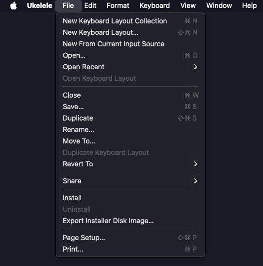

# ひらがな-カタカナ - Custom Japanese Hiragana/Katakana Dual-Mode Learning Input Source for macOS

## **Project Overview**

ひらがな-カタカナ is an open source dual-mode keyboard layout for Hiragana and Katakana characters on QWERTY keyboards, designed for Japanese language learning. The layout features a Caps Lock toggle that switches between Hiragana mode (Caps Lock OFF) and Katakana mode (Caps Lock ON), with each mode having its own Shift layer for small characters and special symbols.

# **Important Note** 

- This is not for normal use, you cannot write in normal Japanese with Hiragana, Katakana, and Kanji combined. 
- It is only to learn how to recognize Hiragana characters it does not work to type Katakana and Kanji and it does not use Romaji or Kana style text replacement features. 
- This solution only provides Hiragana character coverage with direct key mapping.

# **⚠️ CRITICAL WARNING - KNOWN ISSUE**

**🚨 NUMPAD 4 KEY CRASH BUG**

There is a **critical bug** that causes application crashes when using the numpad 4 key while Caps Lock is active (Katakana mode). This affects Chrome and potentially other applications.

**What happens**: Pressing numpad 4 with Caps Lock ON causes immediate application crash with `EXC_BREAKPOINT` error.

**Workaround**: 
- **DO NOT** use numpad 4 key when Caps Lock is active
- Use the main keyboard's `=` key instead for equals operations
- Switch to ABC input source if you need to use numpad 4

**Status**: This is a known issue being investigated. See `DEVELOPMENT_README.md` for technical details.

**Affected Keys**: Numpad 4 (key code 86) only
**Affected Mode**: Caps Lock ON (Katakana mode) only
**Safe Mode**: Caps Lock OFF (Hiragana mode) works normally

## **Key Features**
- **Dual-Mode Layout**: Caps Lock toggle switches between Hiragana and Katakana modes
- **Complete Hiragana Set**: All 46 basic Hiragana characters mapped (Caps Lock OFF)
- **Complete Katakana Set**: All 46 basic Katakana characters mapped (Caps Lock ON)
- **Four-Layer System**: Each mode has its own Shift layer for small characters and special symbols
- **Intuitive Shift Mappings**: Small characters on same keys as large counterparts in both modes
- **Complete Small Character Sets**: All essential small hiragana (ぁぃぅぇぉゃゅょっ) and katakana (ァィゥェォャュョッ)
- **Combining Characters**: Combining Dakuten (゙) and Combining Handakuten (゚) work in both modes
- **を/ヲ (wo)**: Typed with shift plus わ/ワ(wa) in respective modes
- **ー (long vowel)**: Typed with shift plus む/ム(mu) in both modes
- **Direct Input Method**: No IME conversion required for either script

## **Target Hardware**
Designed for custom mechanical keyboards with Hiragana legends, specifically the DROP x MiTo Laser R2 GMK 'Kobe' Hiragana legends keycaps or compatible sets that are a popular option at the moment.

# **Installation**
Choose from the following methods of installation
## **Method 1: Direct Installation (Recommended)**

1. **Download the layout file:**
   - Copy `Hiragana_Katakana.keylayout` to `~/Library/Keyboard Layouts/`

2. **Restart your Mac:**
   - Log out and back in, or restart completely

3. **Add to Input Sources:**
   - Go to **System Settings** > **Keyboard** > **Input Sources** (macOS 13+)
   - Or **System Preferences** > **Keyboard** > **Input Sources** (macOS 12 and earlier)
   - Click the "+" button
   - Find "ひらがな-カタカナ" in the list and add it

4. **Select the layout:**
   - Use the input source menu in your menu bar to switch to ひらがな-カタカナ
   - **Caps Lock Toggle**: Press Caps Lock to switch between Hiragana (OFF) and Katakana (ON) modes

## **Method 2: Ukelele Installation**

For the easiest installation using Ukelele's built-in installer:

1. **Download Ukelele** from [software.sil.org/ukelele](https://software.sil.org/ukelele/)
2. **Open the layout:** File → Open → Select `Hiragana_Katakana.keylayout`
3. **Install directly:** File → Install (see screenshot below)
4. **Restart your Mac** to activate the input source
5. **Add to Input Sources:** Go to System Settings/Preferences > Keyboard > Input Sources and add "ひらがな-カタカナ"

# **How to Use**

### **Layer Switching with Caps Lock**
The layout has two main modes controlled by the Caps Lock key:
- **Caps Lock OFF (Hiragana Mode)**: Type Hiragana characters
- **Caps Lock ON (Katakana Mode)**: Type Katakana characters
- **Caps Lock LED**: Indicates which mode is active (ON = Katakana, OFF = Hiragana)
- **Each mode has its own Shift layer** for small characters and special symbols

### **Basic Characters**

#### **Hiragana Mode (Caps Lock OFF)**
Type normally for basic Hiragana characters. All 46 basic Hiragana characters are mapped to QWERTY keys.

#### **Katakana Mode (Caps Lock ON)**
Type normally for basic Katakana characters. All 46 basic Katakana characters are mapped to the same QWERTY keys as their Hiragana counterparts for intuitive learning.

### **Small Characters & Special Symbols**
Each mode has its own Shift layer for small characters and special symbols:

#### **Hiragana Mode (Caps Lock OFF + Shift)**
- **Shift+0**: を (wo) - Object particle
- **Shift+3**: ぁ (small あ)
- **Shift+4**: ぅ (small う) 
- **Shift+5**: ぇ (small え)
- **Shift+6**: ぉ (small お)
- **Shift+7**: ゃ (small や)
- **Shift+8**: ゅ (small ゆ)
- **Shift+9**: ょ (small よ)
- **Shift+E**: ぃ (small い)
- **Shift+Z**: っ (small つ) - Essential for double consonants
- **Shift+む**: ー (long vowel sound) - Long dash for vowel extension

#### **Katakana Mode (Caps Lock ON + Shift)**
- **Shift+0**: ヲ (wo) - Object particle
- **Shift+3**: ァ (small ア)
- **Shift+4**: ゥ (small ウ) 
- **Shift+5**: ェ (small エ)
- **Shift+6**: ォ (small オ)
- **Shift+7**: ャ (small ヤ)
- **Shift+8**: ュ (small ユ)
- **Shift+9**: ョ (small ヨ)
- **Shift+E**: ィ (small イ)
- **Shift+Z**: ッ (small ツ) - Essential for double consonants
- **Shift+む**: ー (long vowel sound) - Long dash for vowel extension

### **Combining Characters**
The combining characters work in both Hiragana and Katakana modes:
- **Type base character + ゙ (dakuten)**: か + ゙ = が (ga) / カ + ゙ = ガ (ga)
- **Type base character + ゚ (handakuten)**: は + ゚ = ぱ (pa) / ハ + ゚ = パ (pa)

**Examples:**

#### **Hiragana Mode (Caps Lock OFF)**
- ひらがな (hiragana): Type ひ + ら + が + な
- こんにちは (konnichiwa): Type こ + ん + に + ち + は
- がっこう (gakkou): Type が + っ + こ + う

#### **Katakana Mode (Caps Lock ON)**
- ヒラガナ (HIRAGANA): Type ヒ + ラ + ガ + ナ
- コンニチハ (KONNICHIWA): Type コ + ン + ニ + チ + ハ
- ガッコウ (GAKKOU): Type ガ + ッ + コ + ウ
- コーヒー (koohii): Type コ + ー + ヒ + ー (using Shift+む for ー in both modes)

## **Key Mapping Reference**

### **Four-Layer System Overview**

The layout has four distinct layers accessible through modifier combinations:
- **Layer 0**: Hiragana Base (Caps Lock OFF, no modifiers)
- **Layer 1**: Hiragana Shift (Caps Lock OFF + Shift)
- **Layer 2**: Katakana Base (Caps Lock ON, no modifiers)
- **Layer 3**: Katakana Shift (Caps Lock ON + Shift)

### **macOS Key Code Reference**

**Important**: In macOS keyboard layouts, key codes correspond to **physical key positions** on a US QWERTY keyboard, not the characters they produce.

#### **Layer 0: Hiragana Base (Caps Lock OFF)**

| Physical Key | Key Code | Hiragana Output | Notes |
|--------------|----------|-----------------|-------|
| **Number Row** | | | |
| ` | 50 | ろ (ro) | Backtick key |
| 1 | 18 | ぬ (nu) | |
| 2 | 19 | ふ (fu) | |
| 3 | 20 | あ (a) | |
| 4 | 21 | う (u) | |
| 5 | 23 | え (e) | |
| 6 | 22 | お (o) | |
| 7 | 26 | や (ya) | |
| 8 | 28 | ゆ (yu) | |
| 9 | 25 | よ (yo) | |
| 0 | 29 | わ (wa) | |
| - | 27 | ほ (ho) | |
| = | 24 | へ (he) | |
| **Top Row** | | | |
| Q | 12 | た (ta) | |
| W | 13 | て (te) | |
| E | 14 | い (i) | |
| R | 15 | す (su) | |
| T | 17 | か (ka) | |
| Y | 16 | ん (n) | |
| U | 32 | な (na) | |
| I | 34 | に (ni) | |
| O | 31 | ら (ra) | |
| P | 35 | せ (se) | |
| [ | 33 | ゙ (dakuten) | Combining character |
| ] | 30 | ゚ (handakuten) | Combining character |
| \ | 42 | む (mu) | |
| **Home Row** | | | |
| A | 0 | ち (chi) | |
| S | 1 | と (to) | |
| D | 2 | し (shi) | |
| F | 3 | は (ha) | |
| G | 5 | き (ki) | |
| H | 4 | く (ku) | |
| J | 38 | ま (ma) | |
| K | 40 | の (no) | |
| L | 37 | り (ri) | |
| ; | 41 | れ (re) | |
| ' | 39 | け (ke) | |
| **Bottom Row** | | | |
| Z | 6 | つ (tsu) | |
| X | 7 | さ (sa) | |
| C | 8 | そ (so) | |
| V | 9 | ひ (hi) | |
| B | 11 | こ (ko) | |
| N | 45 | み (mi) | |
| M | 46 | も (mo) | |
| , | 43 | ね (ne) | |
| . | 47 | る (ru) | |
| / | 44 | め (me) | |
| **Control Keys** | | | |
| Tab | 48 | Tab character | Preserved functionality |
| Space | 49 | Space character | Preserved functionality |
| Backspace | 51 | Backspace character | Preserved functionality |
| Enter | 36 | Carriage Return | Preserved functionality |
| Escape | 53 | Escape character | Preserved functionality |
|| **Keys Above Arrows** | | | |
|| ; | 114 | ; | Semicolon for mixed text input |
|| ' | 115 | ' | Apostrophe for contractions and possessives |
|| [ | 116 | [ | Left bracket for text formatting |
|| , | 117 | , | Comma for sentence pauses |
|| . | 119 | 。 | Japanese period (maru) for proper sentence endings |
|| / | 121 | / | Forward slash for mixed text and URLs |
|| **Arrow Keys** | | | |
|| ← | 123 | Left Arrow | Standard left navigation |
|| → | 124 | Right Arrow | Standard right navigation |
|| ↓ | 125 | Down Arrow | Standard down navigation |
|| ↑ | 126 | Up Arrow | Standard up navigation |
|| **Numpad Keys** | | | |
|| Numpad 0 | 65 | 0 | Standard numeric input |
|| Numpad = | 67 | = | Mathematical equals sign |
|| Numpad ] | 71 | ] | Right bracket for mathematical expressions |
|| Numpad - | 75 | - | Mathematical minus sign |
|| Numpad Enter | 76 | ETX | Text termination control character |
|| Numpad \ | 81 | \ | Backslash for mathematical expressions |
|| Numpad 1-9 | 83-92 | 1-9 | Standard numeric input (1-9) |
#### **Shift Key Mappings (Small Characters & Special Symbols)**

| Physical Key | Key Code | Shift+Output | Notes |
|--------------|----------|--------------|-------|
| **Number Row** | | | |
| 0 | 29 | を (wo) | Object particle (on same key as わ) |
| 3 | 20 | ぁ (small あ) | Small vowel character |
| 4 | 21 | ぅ (small う) | Small vowel character |
| 5 | 23 | ぇ (small え) | Small vowel character |
| 6 | 22 | ぉ (small お) | Small vowel character |
| 7 | 26 | ゃ (small や) | Small ya character |
| 8 | 28 | ゅ (small ゆ) | Small yu character |
| 9 | 25 | ょ (small よ) | Small yo character |
| **Top Row** | | | |
| E | 14 | ぃ (small い) | Small vowel character |
| **Bottom Row** | | | |
| Z | 6 | っ (small つ) | Small tsu for double consonants |
| **Special Symbols** | | | |
| む | 42 | ー (long vowel) | Long dash for vowel extension |

**Note**: Small characters are placed on the same keys as their large counterparts for intuitive access.

|| **Shift+Special Keys** | | | |
|| Shift+; | 114 | : | Colon for time and ratios |
|| Shift+' | 115 | " | Double quote for dialogue and emphasis |
|| Shift+[ | 116 | { | Left brace for text formatting |
|| Shift+, | 117 | < | Less than symbol for HTML and markup |
|| Shift+. | 119 | > | Greater than symbol for HTML and markup |
|| Shift+/ | 121 | ? | Question mark for questions |
|| **Shift+Arrow Keys** | | | |
|| Shift+← | 123 | (empty) | System default behavior (text selection) |
|| Shift+→ | 124 | (empty) | System default behavior (text selection) |
|| Shift+↓ | 125 | (empty) | System default behavior (text selection) |
|| Shift+↑ | 126 | (empty) | System default behavior (text selection) |
|| **Shift+Numpad Keys** | | | |
|| Shift+Numpad 0 | 65 | ) | Right parenthesis for mathematical expressions |
|| Shift+Numpad = | 67 | + | Plus sign for mathematical operations |
|| Shift+Numpad ] | 71 | } | Right brace for text formatting |
|| Shift+Numpad - | 75 | _ | Underscore for text formatting |
|| Shift+Numpad \ | 81 | | | Vertical bar for text formatting |
|| Shift+1-9 | 83-92 | !@#$%^&*() | Standard QWERTY number row symbols |
#### **Layer 2: Katakana Base (Caps Lock ON)**

| Physical Key | Key Code | Katakana Output | Notes |
|--------------|----------|-----------------|-------|
| **Number Row** | | | |
| ` | 50 | ロ (ro) | Backtick key |
| 1 | 18 | ヌ (nu) | |
| 2 | 19 | フ (fu) | |
| 3 | 20 | ア (a) | |
| 4 | 21 | ウ (u) | |
| 5 | 23 | エ (e) | |
| 6 | 22 | オ (o) | |
| 7 | 26 | ヤ (ya) | |
| 8 | 28 | ユ (yu) | |
| 9 | 25 | ヨ (yo) | |
| 0 | 29 | ワ (wa) | |
| - | 27 | ホ (ho) | |
| = | 24 | ヘ (he) | |
| **Top Row** | | | |
| Q | 12 | タ (ta) | |
| W | 13 | テ (te) | |
| E | 14 | イ (i) | |
| R | 15 | ス (su) | |
| T | 17 | カ (ka) | |
| Y | 16 | ン (n) | |
| U | 32 | ナ (na) | |
| I | 34 | ニ (ni) | |
| O | 31 | ラ (ra) | |
| P | 35 | セ (se) | |
| [ | 33 | ゙ (dakuten) | Combining character |
| ] | 30 | ゚ (handakuten) | Combining character |
| \ | 42 | ム (mu) | |
| **Home Row** | | | |
| A | 0 | チ (chi) | |
| S | 1 | ト (to) | |
| D | 2 | シ (shi) | |
| F | 3 | ハ (ha) | |
| G | 5 | キ (ki) | |
| H | 4 | ク (ku) | |
| J | 38 | マ (ma) | |
| K | 40 | ノ (no) | |
| L | 37 | リ (ri) | |
| ; | 41 | レ (re) | |
| ' | 39 | ケ (ke) | |
| **Bottom Row** | | | |
| Z | 6 | ツ (tsu) | |
| X | 7 | サ (sa) | |
| C | 8 | ソ (so) | |
| V | 9 | ヒ (hi) | |
| B | 11 | コ (ko) | |
| N | 45 | ミ (mi) | |
| M | 46 | モ (mo) | |
| , | 43 | ネ (ne) | |
| . | 47 | ル (ru) | |
| / | 44 | メ (me) | |
| **Control Keys** | | | |
| Tab | 48 | Tab character | Preserved functionality |
| Space | 49 | Space character | Preserved functionality |
| Backspace | 51 | Backspace character | Preserved functionality |
| Enter | 36 | Carriage Return | Preserved functionality |
| Escape | 53 | Escape character | Preserved functionality |
|| **Keys Above Arrows** | | | |
|| ; | 114 | ; | Semicolon for mixed text input |
|| ' | 115 | ' | Apostrophe for contractions and possessives |
|| [ | 116 | [ | Left bracket for text formatting |
|| , | 117 | , | Comma for sentence pauses |
|| . | 119 | 。 | Japanese period (maru) for proper sentence endings |
|| / | 121 | / | Forward slash for mixed text and URLs |
|| **Arrow Keys** | | | |
|| ← | 123 | Left Arrow | Standard left navigation |
|| → | 124 | Right Arrow | Standard right navigation |
|| ↓ | 125 | Down Arrow | Standard down navigation |
|| ↑ | 126 | Up Arrow | Standard up navigation |
|| **Numpad Keys** | | | |
|| Numpad 0 | 65 | 0 | Standard numeric input |
|| Numpad = | 67 | = | Mathematical equals sign |
|| Numpad ] | 71 | ] | Right bracket for mathematical expressions |
|| Numpad - | 75 | - | Mathematical minus sign |
|| Numpad Enter | 76 | ETX | Text termination control character |
|| Numpad \ | 81 | \ | Backslash for mathematical expressions |
|| Numpad 1-9 | 83-92 | 1-9 | Standard numeric input (1-9) |
#### **Layer 3: Katakana Shift (Caps Lock ON + Shift)**

| Physical Key | Key Code | Shift+Output | Notes |
|--------------|----------|--------------|-------|
| **Number Row** | | | |
| 0 | 29 | ヲ (wo) | Object particle (on same key as ワ) |
| 3 | 20 | ァ (small ア) | Small vowel character |
| 4 | 21 | ゥ (small ウ) | Small vowel character |
| 5 | 23 | ェ (small エ) | Small vowel character |
| 6 | 22 | ォ (small オ) | Small vowel character |
| 7 | 26 | ャ (small ヤ) | Small ya character |
| 8 | 28 | ュ (small ユ) | Small yu character |
| 9 | 25 | ョ (small ヨ) | Small yo character |
| **Top Row** | | | |
| E | 14 | ィ (small イ) | Small vowel character |
| **Bottom Row** | | | |
| Z | 6 | ッ (small ツ) | Small tsu for double consonants |
| **Special Symbols** | | | |
| ム | 42 | ー (long vowel) | Long dash for vowel extension |

**Note**: Katakana characters follow the same key positions as their Hiragana counterparts for intuitive learning.

|| **Shift+Special Keys** | | | |
|| Shift+; | 114 | : | Colon for time and ratios |
|| Shift+' | 115 | " | Double quote for dialogue and emphasis |
|| Shift+[ | 116 | { | Left brace for text formatting |
|| Shift+, | 117 | < | Less than symbol for HTML and markup |
|| Shift+. | 119 | > | Greater than symbol for HTML and markup |
|| Shift+/ | 121 | ? | Question mark for questions |
|| **Shift+Arrow Keys** | | | |
|| Shift+← | 123 | (empty) | System default behavior (text selection) |
|| Shift+→ | 124 | (empty) | System default behavior (text selection) |
|| Shift+↓ | 125 | (empty) | System default behavior (text selection) |
|| Shift+↑ | 126 | (empty) | System default behavior (text selection) |
|| **Shift+Numpad Keys** | | | |
|| Shift+Numpad 0 | 65 | ) | Right parenthesis for mathematical expressions |
|| Shift+Numpad = | 67 | + | Plus sign for mathematical operations |
|| Shift+Numpad ] | 71 | } | Right brace for text formatting |
|| Shift+Numpad - | 75 | _ | Underscore for text formatting |
|| Shift+Numpad \ | 81 | | | Vertical bar for text formatting |
|| Shift+1-9 | 83-92 | !@#$%^&*() | Standard QWERTY number row symbols |
## **Using Ukelele to Edit This Layout**

Ukelele is the recommended tool for editing and customizing this keyboard layout. This section provides comprehensive instructions for using Ukelele with the dual-mode Hiragana-Katakana layout.

### **Downloading and Installing Ukelele**

1. **Download Ukelele**: Visit [software.sil.org/ukelele](https://software.sil.org/ukelele/) and download the latest version
2. **Install Ukelele**: Drag the application to your Applications folder
3. **Launch Ukelele**: Open the application from Applications or Spotlight

### **Opening the Layout File**

1. **Open the layout**: File → Open → Navigate to `Hiragana_Katakana.keylayout`
2. **Verify loading**: You should see the virtual keyboard with Hiragana characters displayed
3. **Check modifier layers**: Look for the modifier selector in the toolbar or window

### **Understanding the Four Modifier Layers**

The layout has four distinct layers accessible through the modifier selector:

#### **Layer 0: Hiragana Base (No Modifiers)**
- **Access**: Select "No Modifier" in the modifier dropdown
- **Content**: All 46 basic Hiragana characters
- **Usage**: This is the default layer when Caps Lock is OFF

#### **Layer 1: Hiragana Shift (Shift Modifier)**
- **Access**: Select "Shift" in the modifier dropdown
- **Content**: Small Hiragana characters and special symbols
- **Usage**: Press Shift while in Hiragana mode

#### **Layer 2: Katakana Base (Caps Lock Modifier)**
- **Access**: Select "Caps Lock" in the modifier dropdown
- **Content**: All 46 basic Katakana characters
- **Usage**: This is the default layer when Caps Lock is ON

#### **Layer 3: Katakana Shift (Caps Lock + Shift)**
- **Access**: Select "Caps Lock + Shift" in the modifier dropdown
- **Content**: Small Katakana characters and special symbols
- **Usage**: Press Shift while in Katakana mode

### **Editing Character Mappings**

#### **Basic Character Editing**
1. **Select the target layer**: Choose the appropriate modifier combination
2. **Double-click a key**: Click on the virtual keyboard key you want to edit
3. **Enter new character**: Type or paste the desired character
4. **Confirm changes**: Click OK to save the mapping

#### **Using Character Viewer for Japanese Characters**
1. **Open Character Viewer**: Edit → Special Characters (or Cmd+Option+T)
2. **Search for characters**: Use the search box to find specific Japanese characters
3. **Copy characters**: Double-click to copy characters to clipboard
4. **Paste in Ukelele**: Paste into the key mapping dialog

#### **Editing Caps Lock Layer (Katakana)**
1. **Select Caps Lock modifier**: Choose "Caps Lock" from the modifier dropdown
2. **Verify layer is unlinked**: The layer should show empty/unmapped keys initially
3. **Map Katakana characters**: Double-click each key and enter the corresponding Katakana
4. **Use parallel mapping**: Map the same QWERTY key to the corresponding Katakana character

### **Unlinking Modifier Sets for Independent Layers**

To ensure the Caps Lock layer works independently:

1. **Select Caps Lock layer**: Choose "Caps Lock" from the modifier dropdown
2. **Unlink the layer**: Keyboard → Unlink Modifier Set...
3. **Select Caps Lock**: Choose "Caps Lock" from the dialog
4. **Confirm unlink**: Click OK to break the link with other layers
5. **Repeat for Shift+Caps**: Do the same for "Caps Lock + Shift" layer

### **Installing Layouts from Ukelele**

#### **Method 1: Direct Install (Recommended)**
1. **Open your layout**: File → Open → Select `Hiragana_Katakana.keylayout`
2. **Install directly**: File → Install
3. **Confirm installation**: Ukelele will copy the file to the correct system location
4. **Restart required**: Log out and back in for the layout to be recognized

#### **Method 2: Manual Installation**
1. **Export the layout**: File → Save As... → Choose location
2. **Copy to system directory**: Manually copy to `~/Library/Keyboard Layouts/`
3. **Set permissions**: Ensure file has 644 permissions
4. **Restart system**: Log out and back in

### **Testing Your Changes**

#### **Before Installing**
1. **Test in Ukelele**: Use the built-in test feature
2. **Check all layers**: Verify all four modifier combinations work
3. **Validate characters**: Ensure Japanese characters display correctly

#### **After Installing**
1. **Add to Input Sources**: System Settings → Keyboard → Input Sources
2. **Test Caps Lock toggle**: Verify switching between Hiragana and Katakana modes
3. **Test Shift layers**: Verify small characters work in both modes
4. **Test in applications**: Try TextEdit, Terminal, and web browsers

### **Troubleshooting Common Issues**

#### **Dead Key Problem (Green/Red Keys)**
If you accidentally create a dead key (key turns green/red):

1. **Identify the problematic state**: Look for "State 1", "State 2", etc. in the States panel
2. **Delete the dead key state**: Right-click the colored key → Delete Dead Key...
3. **Confirm deletion**: Click OK to remove the dead key definition
4. **Re-map the key**: Double-click the key and enter the desired character
5. **Test the fix**: The key should return to normal color

#### **Layout Not Appearing in Input Sources**
1. **Check file location**: Ensure file is in `~/Library/Keyboard Layouts/`
2. **Verify file permissions**: Should be 644 (readable by all users)
3. **Restart required**: Log out and back in completely
4. **Check file format**: Ensure it's a valid .keylayout file

#### **Caps Lock Toggle Not Working**
1. **Verify modifier map**: Check that Caps Lock is properly configured
2. **Check layer unlinking**: Ensure Caps Lock layer is unlinked from others
3. **Test in Ukelele**: Verify the layer shows different characters
4. **System restart**: May require complete restart to activate

#### **Characters Not Displaying Correctly**
1. **Check encoding**: Ensure UTF-8 encoding is used
2. **Verify character input**: Use Character Viewer to get correct characters
3. **Test in different apps**: Some applications may not support all characters
4. **Check font support**: Ensure the font supports Japanese characters

### **Advanced Customization**

#### **Adding New Characters**
1. **Identify available keys**: Find unused key positions
2. **Map to appropriate layer**: Choose the right modifier combination
3. **Use combining characters**: For diacritical marks and modifications
4. **Test thoroughly**: Verify in multiple applications

#### **Modifying Existing Mappings**
1. **Backup first**: Always save a copy before making changes
2. **Edit systematically**: Work through one layer at a time
3. **Maintain consistency**: Keep parallel mappings between Hiragana and Katakana
4. **Document changes**: Keep notes of what you've modified

### **Complete Katakana Character Reference for Ukelele**

When editing the Katakana layers, use this reference for accurate character mapping:

| QWERTY Key | Katakana Base | Katakana Shift |
|------------|---------------|----------------|
| Q | タ (ta) | - |
| W | テ (te) | - |
| E | イ (i) | ィ (small i) |
| R | ス (su) | - |
| T | カ (ka) | - |
| Y | ン (n) | - |
| U | ナ (na) | - |
| I | ニ (ni) | - |
| O | ラ (ra) | - |
| P | セ (se) | - |
| A | チ (chi) | - |
| S | ト (to) | - |
| D | シ (shi) | - |
| F | ハ (ha) | - |
| G | キ (ki) | - |
| H | ク (ku) | - |
| J | マ (ma) | - |
| K | ノ (no) | - |
| L | リ (ri) | - |
| Z | ツ (tsu) | ッ (small tsu) |
| X | サ (sa) | - |
| C | ソ (so) | - |
| V | ヒ (hi) | - |
| B | コ (ko) | - |
| N | ミ (mi) | - |
| M | モ (mo) | - |

**Number Row (with small characters on Shift)**:
- 0: ワ (wa) / ヲ (wo)
- 1: ヌ (nu) / -
- 2: フ (fu) / -
- 3: ア (a) / ァ (small a)
- 4: ウ (u) / ゥ (small u)
- 5: エ (e) / ェ (small e)
- 6: オ (o) / ォ (small o)
- 7: ヤ (ya) / ャ (small ya)
- 8: ユ (yu) / ュ (small yu)
- 9: ヨ (yo) / ョ (small yo)

## **Visual Layout Reference**

.png)

## **Troubleshooting**

### **Input Source Not Appearing**
1. **Check file location:** Ensure `Hiragana_Katakana.keylayout` is in `~/Library/Keyboard Layouts/`
2. **Restart required:** Log out and back in, or restart your Mac
3. **Check permissions:** File should be readable (644 permissions)
4. **Manual activation:** Go to System Settings/Preferences > Keyboard > Input Sources to add manually

### **Characters Not Typing**
1. **Select correct input source:** Use the input source menu in your menu bar
2. **Test in different apps:** Try TextEdit, Terminal, or a web browser
3. **Check encoding:** Ensure the application supports UTF-8

### **Layout Validation Errors**
1. **"Key element with code X is repeated" error:**
   - This indicates duplicate key mappings in the layout file
   - Each key code should appear only once in the base mapping
   - Check the key code reference table for correct mappings
2. **"Keyboard layout was invalid" error:**
   - Verify the layout file is valid XML
   - Ensure all key codes correspond to physical QWERTY positions
   - Check for missing or incorrect key code mappings

## **Technical Specifications**

### **File Format & Structure**
- **Format**: XML-based .keylayout file (Apple KeyboardLayout.dtd v1.0 compliant)
- **Encoding**: UTF-8 (full Japanese character support)
- **Layout ID**: 16396 (Ukelele-generated, system-compatible)
- **Group**: 1 (keyboard group identifier)
- **Max Output**: 2 (supports multi-character output)
- **Structure**: ANSI layout (standard US keyboard compatibility)

### **Character Mapping Strategy**
- **Direct Mapping**: QWERTY → Hiragana (no Romaji conversion)
- **Complete Coverage**: All 46 basic Hiragana characters + small characters
- **Frequency Optimization**: High-frequency characters on easily accessible keys
- **Learning Progression**: Arranged for beginner-friendly learning
- **Control Preservation**: Essential keys (Enter, Tab, Backspace, Space) maintain functionality
- **Intuitive Shift Mappings**: Small characters on same keys as large counterparts

### **System Requirements**
- **macOS**: 10.12+ (tested on macOS 15.7.1)
- **Keyboard Types**: ANSI, ISO (with minor adjustments)
- **Input Methods**: Direct character input, IME bypass
- **File Size**: ~7.5KB (optimized for performance)

### **Security & Compliance**
- **No External Dependencies**: Local file system only
- **No Network Access**: Completely offline operation
- **Apple DTD Compliance**: Follows official keyboard layout standards
- **Gatekeeper Compatible**: Works with macOS security features

## **Character Coverage**

### **Complete Hiragana Set**
- **Basic Characters**: All 46 basic Hiragana characters
- **Small Characters**: ぁぃぅぇぉゃゅょっ (8 essential small characters)
- **Combining Characters**: ゙ (dakuten), ゚ (handakuten) for voiced/semi-voiced sounds
- **Special Characters**: を (wo) for object particle, ー (long vowel sound) for vowel extension
- **Total Coverage**: 100% of essential Hiragana characters plus long vowel sound for modern Japanese

### **Input Method**
- **Direct Input**: No IME conversion required
- **Combining Characters**: Use ゙ and ゚ to create voiced/semi-voiced sounds
- **UTF-8 Encoding**: Full Japanese character support
- **ANSI Layout**: Standard US keyboard compatibility

## **Files**

- `Hiragana.keylayout` - Main keyboard layout file
- `README.md` - This documentation
- `LICENSE` - CC0-1.0 license
- `DROP_x_MiTo_Laser_R2_Kobe_Hiragana_set.png` - Visual layout reference
- `Ukelele_Install_Menu.png` - Installation guide screenshot

## **License**

This project is released under the CC0-1.0 license (Public Domain). See `LICENSE` file for details.

---

**Status**: ✅ **Production Ready** - Complete Hiragana character coverage with intuitive Shift key mappings