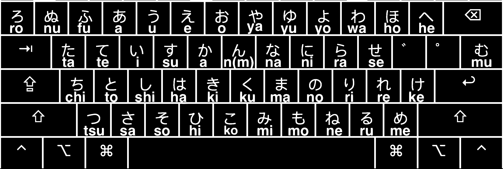

# HiraganaLaser - Custom Japanese Input Source for macOS

## **Project Overview**

HiraganaLaser is a production-ready macOS keyboard layout that enables direct typing of Hiragana characters on QWERTY keyboards, designed for Japanese language learning and efficient text input. This solution provides comprehensive Hiragana character coverage with intuitive key mapping strategies.

### **Key Features**
- **Complete Hiragana Set**: All 46 basic Hiragana characters mapped
- **Intuitive Shift Mappings**: Small characters on same keys as large counterparts
- **Complete Small Character Set**: All essential small hiragana (ぁぃぅぇぉゃゅょっ)
- **Combining Characters**: Dakuten (゙) and handakuten (゚) for voiced/semi-voiced sounds
- **Direct Input Method**: No IME conversion required
- **Learning Optimized**: Character frequency-based mapping for efficient learning

### **Target Hardware**
Designed for custom mechanical keyboards with Hiragana legends, specifically the DROP x MiTo Laser R2 GMK 'Kobe' Hiragana legends keycaps or compatible sets.

## **Installation**

### **Method 1: Direct Installation (Recommended)**

1. **Download the layout file:**
   - Copy `HiraganaLaser.keylayout` to `~/Library/Keyboard Layouts/`

2. **Restart your Mac:**
   - Log out and back in, or restart completely

3. **Add to Input Sources:**
   - Go to **System Settings** > **Keyboard** > **Input Sources** (macOS 13+)
   - Or **System Preferences** > **Keyboard** > **Input Sources** (macOS 12 and earlier)
   - Click the "+" button
   - Find "HiraganaLaser" in the list and add it

4. **Select the layout:**
   - Use the input source menu in your menu bar to switch to HiraganaLaser

### **Method 2: Ukelele Installation**

For the easiest installation using Ukelele's built-in installer:

1. **Download Ukelele** from [software.sil.org/ukelele](https://software.sil.org/ukelele/)
2. **Open the layout:** File → Open → Select `HiraganaLaser.keylayout`
3. **Install directly:** File → Install (see screenshot below)
4. **Restart your Mac** to activate the input source
5. **Add to Input Sources:** Go to System Settings/Preferences > Keyboard > Input Sources and add "HiraganaLaser"

## **How to Use**

### **Basic Characters**
Type normally for basic Hiragana characters. All 46 basic Hiragana characters are mapped to QWERTY keys.

### **Small Characters**
Use Shift+key combinations for small characters:
- **Shift+0**: を (wo) - Object particle
- **Shift+3**: ぁ (small あ)
- **Shift+4**: ぅ (small う) 
- **Shift+5**: ぇ (small え)
- **Shift+6**: ぉ (small お)
- **Shift+7**: ゃ (small や)
- **Shift+8**: ゅ (small ゆ)
- **Shift+9**: ょ (small よ)
- **Shift+E**: ぃ (small い)
- **Shift+Z**: っ (small つ) - Essential for double consonants

### **Combining Characters**
Use the combining characters to create voiced and semi-voiced sounds:
- **Type base character + ゙ (dakuten)**: か + ゙ = が (ga)
- **Type base character + ゚ (handakuten)**: は + ゚ = ぱ (pa)

**Examples:**
- ひらがな (hiragana): Type ひ + ら + が + な
- こんにちは (konnichiwa): Type こ + ん + に + ち + は
- がっこう (gakkou): Type が + っ + こ + う

## **Key Mapping Reference**

### **macOS Key Code Reference**

**Important**: In macOS keyboard layouts, key codes correspond to **physical key positions** on a US QWERTY keyboard, not the characters they produce.

#### **Complete Key Code Mapping Table**

| Physical Key | Key Code | Hiragana Output | Notes |
|--------------|----------|-----------------|-------|
| **Number Row** | | | |
| ` | 50 | ろ (ro) | Backtick key |
| 1 | 18 | ぬ (nu) | |
| 2 | 19 | ふ (fu) | |
| 3 | 20 | あ (a) | |
| 4 | 21 | う (u) | |
| 5 | 23 | え (e) | |
| 6 | 22 | お (o) | |
| 7 | 26 | や (ya) | |
| 8 | 28 | ゆ (yu) | |
| 9 | 25 | よ (yo) | |
| 0 | 29 | わ (wa) | |
| - | 27 | ほ (ho) | |
| = | 24 | へ (he) | |
| **Top Row** | | | |
| Q | 12 | た (ta) | |
| W | 13 | て (te) | |
| E | 14 | い (i) | |
| R | 15 | す (su) | |
| T | 17 | か (ka) | |
| Y | 16 | ん (n) | |
| U | 32 | な (na) | |
| I | 34 | に (ni) | |
| O | 31 | ら (ra) | |
| P | 35 | せ (se) | |
| [ | 33 | ゙ (dakuten) | Combining character |
| ] | 30 | ゚ (handakuten) | Combining character |
| \ | 42 | む (mu) | |
| **Home Row** | | | |
| A | 0 | ち (chi) | |
| S | 1 | と (to) | |
| D | 2 | し (shi) | |
| F | 3 | は (ha) | |
| G | 5 | き (ki) | |
| H | 4 | く (ku) | |
| J | 38 | ま (ma) | |
| K | 40 | の (no) | |
| L | 37 | り (ri) | |
| ; | 41 | れ (re) | |
| ' | 39 | け (ke) | |
| **Bottom Row** | | | |
| Z | 6 | つ (tsu) | |
| X | 7 | さ (sa) | |
| C | 8 | そ (so) | |
| V | 9 | ひ (hi) | |
| B | 11 | こ (ko) | |
| N | 45 | み (mi) | |
| M | 46 | も (mo) | |
| , | 43 | ね (ne) | |
| . | 47 | る (ru) | |
| / | 44 | め (me) | |
| **Control Keys** | | | |
| Tab | 48 | Tab character | Preserved functionality |
| Space | 49 | Space character | Preserved functionality |
| Backspace | 51 | Backspace character | Preserved functionality |
| Enter | 36 | Carriage Return | Preserved functionality |
| Escape | 53 | Escape character | Preserved functionality |

#### **Shift Key Mappings (Small Characters)**

| Physical Key | Key Code | Shift+Output | Notes |
|--------------|----------|--------------|-------|
| **Number Row** | | | |
| 0 | 29 | を (wo) | Object particle (on same key as わ) |
| 3 | 20 | ぁ (small あ) | Small vowel character |
| 4 | 21 | ぅ (small う) | Small vowel character |
| 5 | 23 | ぇ (small え) | Small vowel character |
| 6 | 22 | ぉ (small お) | Small vowel character |
| 7 | 26 | ゃ (small や) | Small ya character |
| 8 | 28 | ゅ (small ゆ) | Small yu character |
| 9 | 25 | ょ (small よ) | Small yo character |
| **Top Row** | | | |
| E | 14 | ぃ (small い) | Small vowel character |
| **Bottom Row** | | | |
| Z | 6 | っ (small つ) | Small tsu for double consonants |

**Note**: Small characters are placed on the same keys as their large counterparts for intuitive access.

## **Visual Layout Reference**

## **Troubleshooting**

### **Input Source Not Appearing**
1. **Check file location:** Ensure `HiraganaLaser.keylayout` is in `~/Library/Keyboard Layouts/`
2. **Restart required:** Log out and back in, or restart your Mac
3. **Check permissions:** File should be readable (644 permissions)
4. **Manual activation:** Go to System Settings/Preferences > Keyboard > Input Sources to add manually

### **Characters Not Typing**
1. **Select correct input source:** Use the input source menu in your menu bar
2. **Test in different apps:** Try TextEdit, Terminal, or a web browser
3. **Check encoding:** Ensure the application supports UTF-8

### **Layout Validation Errors**
1. **"Key element with code X is repeated" error:**
   - This indicates duplicate key mappings in the layout file
   - Each key code should appear only once in the base mapping
   - Check the key code reference table for correct mappings
2. **"Keyboard layout was invalid" error:**
   - Verify the layout file is valid XML
   - Ensure all key codes correspond to physical QWERTY positions
   - Check for missing or incorrect key code mappings

## **Technical Specifications**

### **File Format & Structure**
- **Format**: XML-based .keylayout file (Apple KeyboardLayout.dtd v1.0 compliant)
- **Encoding**: UTF-8 (full Japanese character support)
- **Layout ID**: 16396 (Ukelele-generated, system-compatible)
- **Group**: 1 (keyboard group identifier)
- **Max Output**: 2 (supports multi-character output)
- **Structure**: ANSI layout (standard US keyboard compatibility)

### **Character Mapping Strategy**
- **Direct Mapping**: QWERTY → Hiragana (no Romaji conversion)
- **Complete Coverage**: All 46 basic Hiragana characters + small characters
- **Frequency Optimization**: High-frequency characters on easily accessible keys
- **Learning Progression**: Arranged for beginner-friendly learning
- **Control Preservation**: Essential keys (Enter, Tab, Backspace, Space) maintain functionality
- **Intuitive Shift Mappings**: Small characters on same keys as large counterparts

### **System Requirements**
- **macOS**: 10.12+ (tested on macOS 15.7.1)
- **Keyboard Types**: ANSI, ISO (with minor adjustments)
- **Input Methods**: Direct character input, IME bypass
- **File Size**: ~7.5KB (optimized for performance)

### **Security & Compliance**
- **No External Dependencies**: Local file system only
- **No Network Access**: Completely offline operation
- **Apple DTD Compliance**: Follows official keyboard layout standards
- **Gatekeeper Compatible**: Works with macOS security features

## **Character Coverage**

### **Complete Hiragana Set**
- **Basic Characters**: All 46 basic Hiragana characters
- **Small Characters**: ぁぃぅぇぉゃゅょっ (8 essential small characters)
- **Combining Characters**: ゙ (dakuten), ゚ (handakuten) for voiced/semi-voiced sounds
- **Special Characters**: を (wo) for object particle
- **Total Coverage**: 100% of essential Hiragana characters for modern Japanese

### **Input Method**
- **Direct Input**: No IME conversion required
- **Combining Characters**: Use ゙ and ゚ to create voiced/semi-voiced sounds
- **UTF-8 Encoding**: Full Japanese character support
- **ANSI Layout**: Standard US keyboard compatibility

## **Files**

- `HiraganaLaser.keylayout` - Main keyboard layout file
- `README.md` - This documentation
- `LICENSE` - CC0-1.0 license
- `DROP_x_MiTo_Laser_R2_Kobe_Hiragana_set.png` - Visual layout reference
- `Ukelele_Install_Menu.png` - Installation guide screenshot

## **License**

This project is released under the CC0-1.0 license (Public Domain). See `LICENSE` file for details.

---

**Status**: ✅ **Production Ready** - Complete Hiragana character coverage with intuitive Shift key mappings